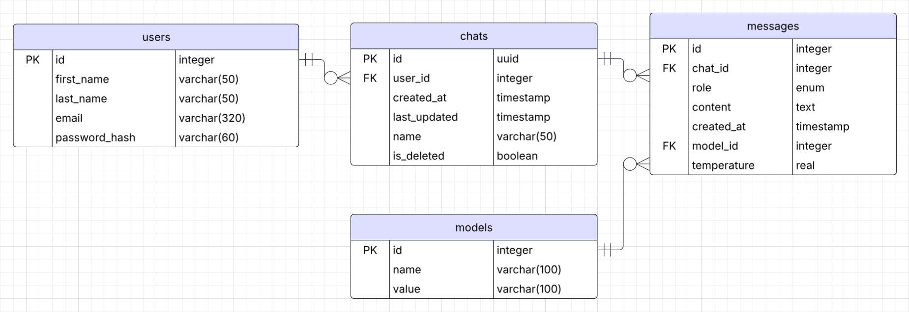

# Libra AI - Backend

A robust Node.js server providing API endpoints for a multi-model LLM chat application with real-time streaming, user authentication, and conversation management. Powered by OpenRouter for access to multiple LLM providers.

## 🚀 Features

- **Multi-LLM Integration**: Access to multiple LLM providers through OpenRouter API
- **OpenAI Library Compatibility**: Uses OpenAI client library for seamless OpenRouter integration
- **Real-Time Streaming**: Server-Sent Events (SSE) for live response streaming
- **Dynamic Model Switching**: Change AI models mid-conversation with context preservation
- **Temperature Control**: Configurable creativity/randomness parameters
- **User Authentication**: Secure registration and login with encrypted passwords
- **Conversation Persistence**: Complete chat history stored in PostgreSQL database
- **Stream Interruption**: API endpoints to stop generation mid-response
- **RESTful API Design**: Clean, documented endpoints for all chat functionality

## 🛠️ Tech Stack

- **Runtime**: Node.js
- **Framework**: Express.js
- **Database**: Supabase (PostgreSQL)
- **Authentication**: JWT tokens with bcrypt password encryption
- **Streaming**: Server-Sent Events (SSE)
- **Deployment**: Render
- **LLM Integration**: OpenRouter API via OpenAI client library

## 🏗️ Architecture

```
┌─────────────────┐    ┌─────────────────────┐    ┌──────────────────┐
│    Frontend     │    │         API         │    │     Database     │
│    (Next.js)    │◄──►│ (Node.js + Express) │◄──►│   (PostgreSQL)   │
│    - Vercel     │    │     - Render        │    │   - Supabase     │
└─────────────────┘    └─────────────────────┘    └──────────────────┘
                                  ▲
                                  │
                                  ▼
                        ┌──────────────────┐
                        │    OpenRouter    │
                        │    - Multiple    │
                        │     LLM Models   │
                        └──────────────────┘
```

## 📡 API Endpoints

### Authentication
- `POST /api/auth/register` - User registration
- `POST /api/auth/login` - User login
- `POST /api/auth/logout` - User logout
- `GET /api/auth/verify` - Verify JWT token
- `GET /api/auth/profile` - Get user's profile

### Chat Management
- `GET /api/chats` - Get user's chat history
- `POST /api/chats` - Create new chat
- `PUT /api/chats?chatId=:id` - Update chat name
- `DELETE /api/chats?chatId=:id` - Delete chat

### Message Management & LLM Interaction
- `POST /api/messages/user?chatId=:id` - Add new user message
- `POST /api/messages/assistant-stream?chatId=:id` - Add new assistant response and stream it (SSE)

### Model Management
- `GET /api/models` - Get available LLM models
- `POST /api/models` - Add new model

## 💾 Database Schema

### Entity Relationship Diagram

*[View Interactive ERD on Lucidchart](https://lucid.app/lucidchart/ad9c154c-d29f-4af2-8afc-d6c9edbfb88d/edit?viewport_loc=399%2C334%2C1879%2C789%2C0_0&invitationId=inv_67709be7-eae6-4168-a2df-e21d7eeda6d3)*

### Users Table
```sql
create table public.users (
  id serial not null,
  first_name character varying(50) not null,
  last_name character varying(50) not null,
  email character varying(320) not null,
  password_hash character varying(60) not null,
  constraint users_pkey primary key (id),
  constraint users_email_key unique (email)
);
```

### Chats Table
```sql
create table public.chats (
  user_id integer not null,
  created_at timestamp without time zone null default now(),
  last_updated timestamp without time zone null default now(),
  name character varying(50) not null default 'New chat'::character varying,
  is_deleted boolean not null default false,
  id uuid not null default gen_random_uuid (),
  constraint chats_pkey primary key (id),
  constraint chats_user_id_fkey foreign KEY (user_id) references users (id)
);
```

### Messages Table
```sql
create table public.messages (
  id serial not null,
  role public.sender_role not null,
  content text not null,
  created_at timestamp without time zone null default CURRENT_TIMESTAMP,
  model_id integer not null,
  chat_id uuid null,
  temperature real null,
  constraint messages_pkey primary key (id),
  constraint messages_model_id_fkey foreign KEY (model_id) references models (id)
);
```

### Models Table
```sql
create table public.models (
  id serial not null,
  name character varying(100) not null,
  value character varying(100) not null,
  constraint models_pkey primary key (id),
  constraint models_value_key unique (value)
);
```

## 🔒 Security Features

- **Password Encryption**: bcrypt hashing for secure password storage
- **JWT Authentication**: Stateless authentication with secure tokens
- **CORS Configuration**: Properly configured cross-origin resource sharing
- **Environment Variables**: Sensitive data stored securely
- **Input Validation**: Client-side validation with server-side verification (zero-trust architecture)
- **Rate Limiting**: API rate limiting to prevent abuse

## 🌐 Deployment

The backend is deployed on Render with the following configuration:

- **Build Command**: `npm install`
- **Start Command**: `npm start`
- **Environment**: Node.js
- **Auto-deployment**: Connected to Git repository

## 💻 Local Development

```bash
# Clone the repository
git clone https://github.com/EtgarAvshalomov/Libra-AI-Backend.git
cd Libra-AI-Backend

# Install dependencies
npm install

# Set up environment variables
cp .env

# Configure your environment variables
CLIENT_URL=http://localhost:3001 # Default for development
PORT=port_number # Optional, the default is 3000
NODE_ENV=development
DATABASE_URL=your_database_url
DIRECT_URL=your_direct_url
JWT_SECRET=your_jwt_secret_key # For password encryption
OPENROUTER_API_KEY=your_openrouter_api_key

# Run development server
npm run dev
```

The server will start on `http://localhost:3000` (or your configured port).

## 📋 Environment Variables

Create a `.env` file with the following variables:

```env
CLIENT_URL=http://localhost:3001 # Default for development
PORT=port_number # Optional, the default is 3000
NODE_ENV=development # Only for development
DATABASE_URL=your_database_url
DIRECT_URL=your_direct_url
JWT_SECRET=your_jwt_secret_key # For password encryption
OPENROUTER_API_KEY=your_openrouter_api_key
```

## 🚀 Available Scripts

```bash
npm start          # Start production server
npm run dev        # Start development server with nodemon
```

## 📊 Features in Detail

### OpenRouter Integration
The server integrates with OpenRouter to provide access to multiple LLM models through a single API interface, using the OpenAI client library for compatibility:

```javascript
import OpenAI from 'openai';

class OpenAIService {
    constructor() {
        this.client = new OpenAI({
            baseURL: 'https://openrouter.ai/api/v1',
            apiKey: process.env.OPENROUTER_API_KEY,
            defaultHeaders: {},
        });
        
        this.defaultModel = 'deepseek/deepseek-chat-v3-0324:free';
    }

    async streamChat({ messages, model = this.defaultModel, max_tokens, temperature = 1 }) {
        const controller = new AbortController();

        const stream = await this.client.chat.completions.create({
            model,
            max_tokens,
            messages,
            temperature,
            stream: true,
            signal: controller.signal
        });

        return {stream, controller};
    }
}
```

### Streaming
We stream the LLM's response via SSE to the client:

```javascript
import openaiService from '../services/openRouterService.js';

// Get the assistant's response
const { stream, controller } = await openaiService.streamChat({
    messages,
    model,
    max_tokens,
    temperature
});

let buffer = '';

let clientAborted = false;

// Enable SSE
res.setHeader("Content-Type", "text/event-stream");
res.setHeader("Cache-Control", "no-cache");
res.setHeader("Connection", "keep-alive");

// Listen for client disconnection and manual abort
req.socket.on('close', () => {
    clientAborted = true;
    controller.abort();
    clearInterval(saveInterval);
});

// Streaming response and saving to buffer
for await (const chunk of stream) {
    if (clientAborted) break;
    
    const content = chunk.choices?.[0]?.delta?.content;
    if (content) {
        res.write(`data: ${JSON.stringify({type: 'content', data: content})}\n\n`);
        buffer += content;
    }
}

res.write(`data: ${JSON.stringify({type: 'done'})}\n\n`);
res.end();
```

### Context Preservation
When users switch models mid-conversation, the complete message history is maintained and passed to the new model for seamless context continuation.

### Temperature Control
Users can adjust the creativity/randomness of responses with temperature values between 0.0 (focused) and 2.0 (creative).

## 🔗 Related Repositories

- [Frontend Repository](https://github.com/EtgarAvshalomov/Libra-AI-Frontend) - Next.js client application

---

Built with ⚡ Node.js and modern backend technologies
